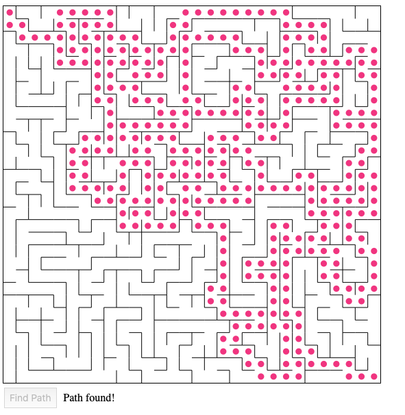

<h2>Generate a maze and find a path from point A to B using JavaScript</h2>

<h3>Description</h3>

To solve the problem I treated the maze as a graph and used a multidimensional array as the underlying data structure. A random depth-first-traversal finds a path to every node and assigns each cell information about it's borders. To move from position A to position B I used a recursive backtracking algorithm that checks if there exists a border to the next neighbour and if there is no border it recursively move on to the next neighbour until it finds the end position B. If a position has no unvisited neighbours left, it backtracks. The array that contains information about the border walls and the current position is then represented graphically using the Canvas API

<h3>The goal</h3>
 <ul>
  <li>Be able to generate a maze and traverse it from position A to position B using JavaScript.</li>
  <li>Represent the maze graphically on a web page.</li>
</ul> 

<h3>The purpose</h3>
 <ul>
  <li>Get practice in <em>recursive depth-first-traversals</em> of a graph and <em>recursive backtracking algortihms</em>.</li>
  <li>Become more comfortable with using <em>JavaScript</em>.</li>
  <li>Get an introduction to the <em>Canvas API</em>.</li>
  <li>Get more practice using <em>Promises</em>.</li>
</ul> 

